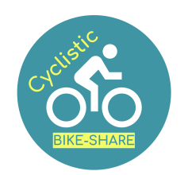

```{r setup, include=FALSE}
knitr::opts_chunk$set(echo = TRUE)
```



# Introduction
Cyclistic is a bike-sharing company in Chicago with 5,824 geotracked bikes across 692 stations. Cyclistic sets itself
apart by also offering reclining bikes, hand tricycles, and cargo bikes, making bike-share more inclusive to people with
disabilities and riders who can’t use a standard two-wheeled bike.

Cyclistic’s finance analysts have concluded that annual members are much more profitable than casual riders. The director of marketing believes that maximizing the number of annual members will be key to future growth. Rather than creating a marketing campaign that targets all-new customers, she believes there is a very good chance to convert casual riders into members.

---

## **Ask**

### Business Task
Discover trends and insights for the marketing team by analyzing Cyclistic historical bike trip data to better understand how annual members and casual riders use Cyclistic bikes differently

### Key Stakeholders
* **Lily Moreno**: The director of marketing and your manager. Moreno is responsible for the development of campaigns
and initiatives to promote the bike-share program. These may include email, social media, and other channels.

* **Cyclistic marketing analytics team**: A team of data analysts who are responsible for collecting, analyzing, and
reporting data that helps guide Cyclistic marketing strategy. You joined this team six months ago and have been busy
learning about Cyclistic’s mission and business goals — as well as how you, as a junior data analyst, can help Cyclistic
achieve them.

* **Cyclistic executive team**: The notoriously detail-oriented executive team will decide whether to approve the
recommended marketing program.

---

## **Prepare**

### Data Source
* Data obtained from [Divvy](https://divvy-tripdata.s3.amazonaws.com/index.html), a bike share company in Chicago 
* Contains trip data from July 2022 - June 2023 with each month stored in a separate csv file
* Data includes: type of bike used, member type,  start and end time, station name, latitude and longitude.


---

## **Process**
### Clean and Transform Data
We are using R to process the data
\
\

#### Load libraries

```{r  message=FALSE}
library(tidyverse)
library(janitor)
```
\
\

#### Import data 
```{r}
m1 <- read.csv("202207-divvy-tripdata.csv", na.strings=c(""))
m2 <- read.csv("202208-divvy-tripdata.csv", na.strings=c(""))
m3 <- read.csv("202209-divvy-publictripdata.csv", na.strings=c(""))
m4 <- read.csv("202210-divvy-tripdata.csv", na.strings=c(""))
m5 <- read.csv("202211-divvy-tripdata.csv", na.strings=c(""))
m6 <- read.csv("202212-divvy-tripdata.csv", na.strings=c(""))
m7 <- read.csv("202301-divvy-tripdata.csv", na.strings=c(""))
m8 <- read.csv("202302-divvy-tripdata.csv", na.strings=c(""))
m9 <- read.csv("202303-divvy-tripdata.csv", na.strings=c(""))
m10 <- read.csv("202304-divvy-tripdata.csv", na.strings=c(""))
m11 <- read.csv("202305-divvy-tripdata.csv", na.strings=c(""))
m12 <- read.csv("202306-divvy-tripdata.csv", na.strings=c(""))

```
\
\

#### Combine data into single dataframe
```{r}
trip_data <- rbind(m1,m2,m3,m4,m5,m6,m7,m8,m9, m10, m11, m12)
```
\
\

#### Check structure of data
```{r}
str(trip_data)
```
\
\

#### Change started_at and ended_at to datetime format
```{r}
trip_data$started_at<- ymd_hms(trip_data$started_at)
trip_data$ended_at<- ymd_hms(trip_data$ended_at)
```
\
\

#### Add columns for for day, month, year and trip duration
```{r}
trip_data$weekday <- wday(trip_data$started_at, label=TRUE, abbr=FALSE)
trip_data$month <- month(trip_data$started_at, label=TRUE)
trip_data$day<- day(trip_data$started_at)
trip_data$year<- year(trip_data$started_at)
trip_data$trip_duration <- as.numeric(difftime(trip_data$ended_at, trip_data$started_at, units = "mins"))
```
\
\

#### Remove trips with negative duration
```{r}
trip_data<- trip_data %>% filter(trip_duration >= 0) 
```
\
\

#### Remove docked bikes
```{r}
trip_data <- trip_data %>% filter(rideable_type != "docked_bike")
```
\
\

#### Inspect data after cleaning
```{r}
  head(trip_data)
```
\
\

---

## **Analyze**

### Perform Calculations

#### Number of trips by rider type
```{r message=FALSE}
trip_data %>%
  group_by(member_casual)  %>% 
  summarise(n = n())
```
* Of all the trips from July 2022 - June 2023, members account for almost 2/3 trips
\
\

#### Number of trips by rider and bicycle type
```{r}
  trip_data %>%
  group_by( rideable_type, member_casual)  %>% 
  summarise(number_of_trips = n())
```
* Both members and casual riders tend to prefer electric bicycles
\
\


#### Summary of trip duration in minutes
```{r}
summary(trip_data$trip_duration)
```
* The average trip duration was 15.3 minutes with the longest being around 26 hours. 
\
\

#### Compare casual vs member ride duration
```{r}
trip_data %>%
  group_by(member_casual)  %>% 
  summarise(mean = mean(trip_duration), median = median(trip_duration), max=max(trip_duration), min=min(trip_duration))
```
 
* Casual riders tend to ride longer on average
\
\


#### Compare ride duration and trips by rider type and day of week
```{r message=FALSE}
trip_data %>%
  group_by(member_casual, weekday)  %>% 
  summarise(number_of_rides = n(),average_duration = mean(trip_duration))
```
* average duration remains relatively consistent for members but peaks during the weekend for casual riders
* number of rides is at its highest during the middle of the week for members and highest for casuals on weekends
\
\

#### Number of rides by hour
```{r message=FALSE}
trip_data %>%
  group_by(member_casual, hour = hour(started_at))  %>% 
  summarise(number_of_rides = n()) 
```
* number of rides for casuals steadily increases until 5pm
* number of riders spikes during rush hour for members
* majority of rides occur during afternoon and early evening for both rider types
\
\

###  Ride duration by month

```{r}
trip_data %>%
  group_by(member_casual, month)  %>%
  summarise(number_of_rides = n(),average_duration = mean(trip_duration)) 

```
* average ride duration across months is fairly consistent for members while duration is much greater during warmer months
* ridership decreases during colder months for both rider types
\
\

---

## **Share**

```{r echo=FALSE}
# remove scientific notation from graphs
options(scipen = 999)

```


### Members vs Casual Riders

```{r echo=FALSE,message=FALSE}
trip_data %>%
  group_by(  member_casual)  %>% 
  summarise(number_of_trips = n()) %>% 
ggplot( aes(x="", y=number_of_trips, fill=member_casual)) +
  geom_bar(stat="identity", width=1, color="white") +
  coord_polar("y", start=0) +
  geom_text(aes(label = paste0(round(number_of_trips/sum(number_of_trips)*100,digits=2), "%")), position = position_stack(vjust=0.5)) +
  labs(x = NULL, y = NULL, fill = NULL)+ 
  theme_void() +
  labs(title= "Percentage of Total Trips")
```

##### Over the last 12 months, casual riders accounted for 37% of trips while members account for 63% of trips
\

```{r echo=FALSE,message=FALSE}
 trip_data %>%
  group_by( rideable_type, member_casual)  %>% 
  summarise(sum = n()) %>% 
  ggplot() +
  geom_col(mapping = aes(x = rideable_type, y = sum, fill=member_casual),position="dodge") +
labs(title= "Number of Trips by Bike Type", fill = "Rider Type", caption = "Total trips from July 2022 - June 2023") +
  ylab("Number of Trips") +
  xlab("")
```

##### Both groups prefer electric bikes. Notably, casual riders greatly prefer electric bikes with nearly 50% more trips taken on electric bikes compared to classic bikes.
\

```{r echo=FALSE,message=FALSE}
trip_data %>%
  group_by(member_casual, weekday)  %>% 
  summarise(number_of_rides = n(),average_duration = mean(trip_duration)) %>% 
  ggplot() +
  geom_col(mapping = aes(x = weekday, y = number_of_rides, fill=member_casual),position="dodge") +
  labs(title= "Number of Trips by Day", fill = "Rider Type", caption = "Total trips from July 2022 - June 2023") +
  ylab("Number of Trips") +
  xlab("")
```

```{r echo=FALSE,message=FALSE}
trip_data %>% 
  group_by(member_casual, weekday) %>% 
  summarise(number_of_rides = n(),average_duration = mean(trip_duration)) %>% 
  ggplot() +
  geom_col(mapping = aes(x = weekday, y = average_duration, fill=member_casual),position="dodge") +
  labs(title= "Average Ride Length by Day", fill = "Rider Type", caption = "Average ride length from July 2022 - June 2023") +
  ylab("Time (minutes)") +
  xlab("")
 
```

##### From the graphs above, we can see that:
* ##### Ride duration of members is very consistent day to day compared to casual riders
* ##### Ridership peaks during the middle of the week for members and weekends for casual riders
* ##### Greater variation in average ride length for casual riders with the longest rides occurring on Saturday and Sunday
\

```{r echo=FALSE,message=FALSE}
trip_data %>%
  group_by(member_casual, month,year)  %>% 
  summarise(number_of_rides = n(),average_duration = mean(trip_duration)) %>% 
  arrange(year) %>% 
  ggplot() +
  geom_col(mapping = aes(x = month, y = average_duration, fill=member_casual),position="dodge") +
labs(title= "Average Ride Length by Month", fill = "Rider Type",caption = "Average ride length from July 2022 - June 2023") +
  ylab("Time (minutes)") +
  xlab("")
```

```{r echo=FALSE,message=FALSE}
trip_data %>%
  group_by(member_casual, month,year)  %>% 
  summarise(number_of_rides = n(),average_duration = mean(trip_duration)) %>% 
  arrange(year) %>% 
  ggplot() +
    geom_col(mapping = aes(x = month, y = number_of_rides, fill=member_casual),position="dodge") + 
  labs(title= "Number of Trips by Month", fill = "Rider Type", caption = "Total trips from July 2022 - June 2023") +
  ylab("Number of Trips") +
  xlab("")

```

##### Looking at the rider data by month, we can see that: 
* ##### Ride duration remains relatively consistent throughout the year for members
* ##### Both groups prefer to ride during warmer months
* ##### Ridership for casual users is at its highest during the summer and drops off relatively quickly compared to members
\

```{r echo=FALSE, message=FALSE}

trip_data %>%
  group_by(member_casual, hour = hour(started_at))  %>% 
  summarise(number_of_rides = n()) %>% 
ggplot(aes(x = hour, y = number_of_rides, group=member_casual, color=member_casual))+
  geom_line()+
  geom_point() +
  scale_x_continuous(breaks=seq(0,23,by=3)) +
  labs(title= "Number of Trips by Time of Day", color = "Rider Type", caption = "Total trips from July 2022 - June 2023") +
  ylab("Number of Trips") +
  xlab("Time of day")
```

##### From above, we can see that:
* ##### Number of trips increases significantly during rush hour for members
* ##### Afternoon to early evening is a popular time for both groups
\

---

## **Act**
1. ##### How do annual members and casual riders use Cyclistic bikes differently?
    * ##### Consistent trip duration throughout the week among members
    * ##### Casual riders take longer rides than members
    * ##### Casual riders ride the most on weekends while members during the middle of the week
    * ##### Ridership for members peaks during commute hours 
\

2. ##### Why would casual riders buy Cyclistic annual memberships?
    * ##### Casual riders who anticipate using the bikes enough throughout the year who would save money by opting for the annual plan.
\

3. ##### How can Cyclistic use digital media to influence casual riders to become members?
    a. ##### Seasonal Promotions: Running limited-time promotions during peak biking season can create a sense of urgency for casual riders to sign up for         membership. Cyclistic can offer discounted rates or additional perks to entice potential members.
    
    b. ##### Promote Bicycle Commuting: Cyclistic can create a digital media campaign to promote bicycle commuting. They can showcase the convenience, cost savings, and health benefits that come with being a Cyclistic member.
