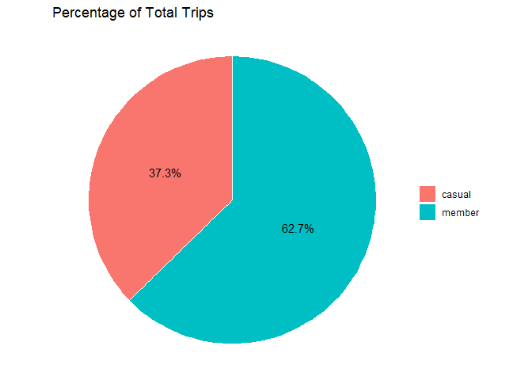
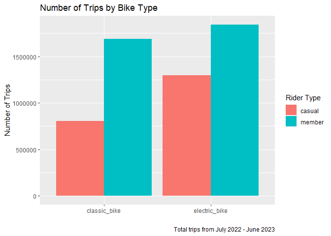
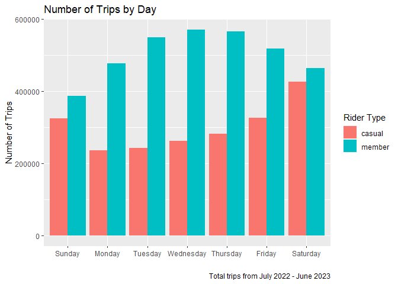
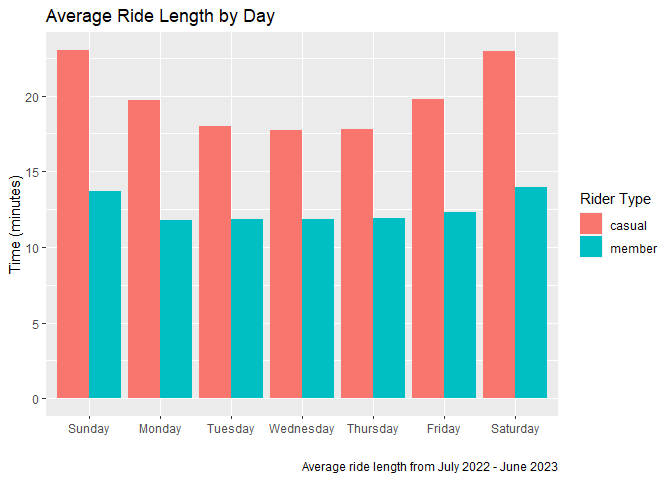
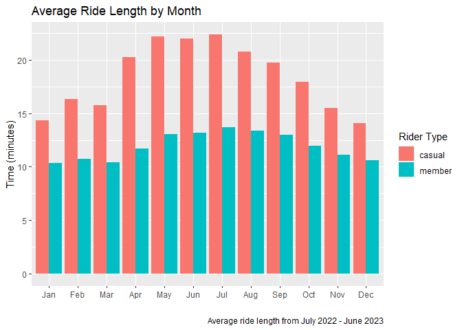
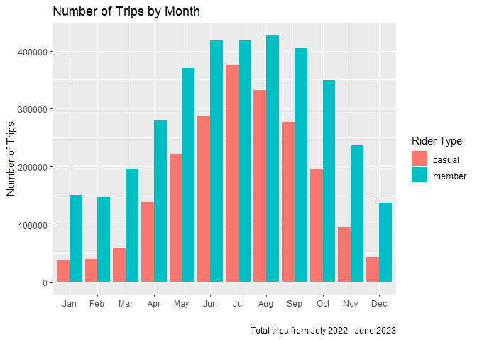
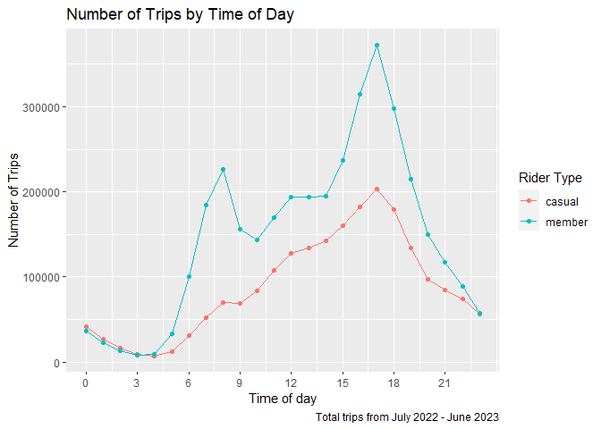

Case Study: How Does a Bike-Share Navigate Speedy Success?
================


# Introduction

Cyclistic is a bike-sharing company in Chicago with 5,824 geotracked
bikes across 692 stations. Cyclistic sets itself apart by also offering
reclining bikes, hand tricycles, and cargo bikes, making bike-share more
inclusive to people with disabilities and riders who can’t use a
standard two-wheeled bike.

Cyclistic’s finance analysts have concluded that annual members are much
more profitable than casual riders. The director of marketing believes
that maximizing the number of annual members will be key to future
growth. Rather than creating a marketing campaign that targets all-new
customers, she believes there is a very good chance to convert casual
riders into members.

------------------------------------------------------------------------

## **Ask**

### Business Task

Discover trends and insights for the marketing team by analyzing
Cyclistic historical bike trip data to better understand how annual
members and casual riders use Cyclistic bikes differently

### Key Stakeholders

- **Lily Moreno**: The director of marketing and your manager. Moreno is
  responsible for the development of campaigns and initiatives to
  promote the bike-share program. These may include email, social media,
  and other channels.

- **Cyclistic marketing analytics team**: A team of data analysts who
  are responsible for collecting, analyzing, and reporting data that
  helps guide Cyclistic marketing strategy. You joined this team six
  months ago and have been busy learning about Cyclistic’s mission and
  business goals — as well as how you, as a junior data analyst, can
  help Cyclistic achieve them.

- **Cyclistic executive team**: The notoriously detail-oriented
  executive team will decide whether to approve the recommended
  marketing program.

------------------------------------------------------------------------

## **Prepare**

### Data Source

- Data obtained from
  [Divvy](https://divvy-tripdata.s3.amazonaws.com/index.html), a bike
  share company in Chicago
- Contains trip data from July 2022 - June 2023 with each month stored
  in a separate csv file
- Data includes: type of bike used, member type, start and end time,
  station name, latitude and longitude.

------------------------------------------------------------------------

## **Process**

### Clean and Transform Data

We are using R to process the data  
  

#### Load libraries

``` r
library(tidyverse)
library(janitor)
```

  
  

#### Import data

``` r
m1 <- read.csv("202207-divvy-tripdata.csv", na.strings=c(""))
m2 <- read.csv("202208-divvy-tripdata.csv", na.strings=c(""))
m3 <- read.csv("202209-divvy-publictripdata.csv", na.strings=c(""))
m4 <- read.csv("202210-divvy-tripdata.csv", na.strings=c(""))
m5 <- read.csv("202211-divvy-tripdata.csv", na.strings=c(""))
m6 <- read.csv("202212-divvy-tripdata.csv", na.strings=c(""))
m7 <- read.csv("202301-divvy-tripdata.csv", na.strings=c(""))
m8 <- read.csv("202302-divvy-tripdata.csv", na.strings=c(""))
m9 <- read.csv("202303-divvy-tripdata.csv", na.strings=c(""))
m10 <- read.csv("202304-divvy-tripdata.csv", na.strings=c(""))
m11 <- read.csv("202305-divvy-tripdata.csv", na.strings=c(""))
m12 <- read.csv("202306-divvy-tripdata.csv", na.strings=c(""))
```

  
  

#### Combine data into single dataframe

``` r
trip_data <- rbind(m1,m2,m3,m4,m5,m6,m7,m8,m9, m10, m11, m12)
```

  
  

#### Check structure of data

``` r
str(trip_data)
```

    ## 'data.frame':    5779444 obs. of  13 variables:
    ##  $ ride_id           : chr  "954144C2F67B1932" "292E027607D218B6" "57765852588AD6E0" "B5B6BE44314590E6" ...
    ##  $ rideable_type     : chr  "classic_bike" "classic_bike" "classic_bike" "classic_bike" ...
    ##  $ started_at        : chr  "2022-07-05 08:12:47" "2022-07-26 12:53:38" "2022-07-03 13:58:49" "2022-07-31 17:44:21" ...
    ##  $ ended_at          : chr  "2022-07-05 08:24:32" "2022-07-26 12:55:31" "2022-07-03 14:06:32" "2022-07-31 18:42:50" ...
    ##  $ start_station_name: chr  "Ashland Ave & Blackhawk St" "Buckingham Fountain (Temp)" "Buckingham Fountain (Temp)" "Buckingham Fountain (Temp)" ...
    ##  $ start_station_id  : chr  "13224" "15541" "15541" "15541" ...
    ##  $ end_station_name  : chr  "Kingsbury St & Kinzie St" "Michigan Ave & 8th St" "Michigan Ave & 8th St" "Woodlawn Ave & 55th St" ...
    ##  $ end_station_id    : chr  "KA1503000043" "623" "623" "TA1307000164" ...
    ##  $ start_lat         : num  41.9 41.9 41.9 41.9 41.9 ...
    ##  $ start_lng         : num  -87.7 -87.6 -87.6 -87.6 -87.6 ...
    ##  $ end_lat           : num  41.9 41.9 41.9 41.8 41.9 ...
    ##  $ end_lng           : num  -87.6 -87.6 -87.6 -87.6 -87.7 ...
    ##  $ member_casual     : chr  "member" "casual" "casual" "casual" ...

  
  

#### Change started_at and ended_at to datetime format

``` r
trip_data$started_at<- ymd_hms(trip_data$started_at)
trip_data$ended_at<- ymd_hms(trip_data$ended_at)
```

  
  

#### Add columns for for day, month, year and trip duration

``` r
trip_data$weekday <- wday(trip_data$started_at, label=TRUE, abbr=FALSE)
trip_data$month <- month(trip_data$started_at, label=TRUE)
trip_data$day<- day(trip_data$started_at)
trip_data$year<- year(trip_data$started_at)
trip_data$trip_duration <- as.numeric(difftime(trip_data$ended_at, trip_data$started_at, units = "mins"))
```

  
  

#### Remove trips with negative duration

``` r
trip_data<- trip_data %>% filter(trip_duration >= 0) 
```

  
  

#### Remove docked bikes

``` r
trip_data <- trip_data %>% filter(rideable_type != "docked_bike")
```

  
  

#### Inspect data after cleaning

``` r
  head(trip_data)
```

    ##            ride_id rideable_type          started_at            ended_at
    ## 1 954144C2F67B1932  classic_bike 2022-07-05 08:12:47 2022-07-05 08:24:32
    ## 2 292E027607D218B6  classic_bike 2022-07-26 12:53:38 2022-07-26 12:55:31
    ## 3 57765852588AD6E0  classic_bike 2022-07-03 13:58:49 2022-07-03 14:06:32
    ## 4 B5B6BE44314590E6  classic_bike 2022-07-31 17:44:21 2022-07-31 18:42:50
    ## 5 A4C331F2A00E79E0  classic_bike 2022-07-13 19:49:06 2022-07-13 20:15:24
    ## 6 579D73BE2ED880B3 electric_bike 2022-07-01 17:04:35 2022-07-01 17:13:18
    ##            start_station_name start_station_id               end_station_name
    ## 1  Ashland Ave & Blackhawk St            13224       Kingsbury St & Kinzie St
    ## 2  Buckingham Fountain (Temp)            15541          Michigan Ave & 8th St
    ## 3  Buckingham Fountain (Temp)            15541          Michigan Ave & 8th St
    ## 4  Buckingham Fountain (Temp)            15541         Woodlawn Ave & 55th St
    ## 5      Wabash Ave & Grand Ave     TA1307000117 Sheffield Ave & Wellington Ave
    ## 6 Desplaines St & Randolph St            15535      Clinton St & Roosevelt Rd
    ##   end_station_id start_lat start_lng  end_lat   end_lng member_casual   weekday
    ## 1   KA1503000043  41.90707 -87.66725 41.88918 -87.63851        member   Tuesday
    ## 2            623  41.86962 -87.62398 41.87277 -87.62398        casual   Tuesday
    ## 3            623  41.86962 -87.62398 41.87277 -87.62398        casual    Sunday
    ## 4   TA1307000164  41.86962 -87.62398 41.79526 -87.59647        casual    Sunday
    ## 5   TA1307000052  41.89147 -87.62676 41.93625 -87.65266        member Wednesday
    ## 6         WL-008  41.88461 -87.64456 41.86712 -87.64109        member    Friday
    ##   month day year trip_duration
    ## 1   Jul   5 2022     11.750000
    ## 2   Jul  26 2022      1.883333
    ## 3   Jul   3 2022      7.716667
    ## 4   Jul  31 2022     58.483333
    ## 5   Jul  13 2022     26.300000
    ## 6   Jul   1 2022      8.716667

  
  

------------------------------------------------------------------------

## **Analyze**

### Perform Calculations

#### Number of trips by rider type

``` r
trip_data %>%
  group_by(member_casual)  %>% 
  summarise(n = n())
```

    ## # A tibble: 2 x 2
    ##   member_casual       n
    ##   <chr>           <int>
    ## 1 casual        2102664
    ## 2 member        3535138

- Of all the trips from July 2022 - June 2023, members account for
  almost 2/3 trips  
    

#### Number of trips by rider and bicycle type

``` r
  trip_data %>%
  group_by( rideable_type, member_casual)  %>% 
  summarise(number_of_trips = n())
```

    ## `summarise()` has grouped output by 'rideable_type'. You can override using the
    ## `.groups` argument.

    ## # A tibble: 4 x 3
    ## # Groups:   rideable_type [2]
    ##   rideable_type member_casual number_of_trips
    ##   <chr>         <chr>                   <int>
    ## 1 classic_bike  casual                 804350
    ## 2 classic_bike  member                1690936
    ## 3 electric_bike casual                1298314
    ## 4 electric_bike member                1844202

- Both members and casual riders tend to prefer electric bicycles  
    

#### Summary of trip duration in minutes

``` r
summary(trip_data$trip_duration)
```

    ##     Min.  1st Qu.   Median     Mean  3rd Qu.     Max. 
    ##    0.000    5.433    9.517   15.298   16.767 1559.933

- The average trip duration was 15.3 minutes with the longest being
  around 26 hours.  
    

#### Compare casual vs member ride duration

``` r
trip_data %>%
  group_by(member_casual)  %>% 
  summarise(mean = mean(trip_duration), median = median(trip_duration), max=max(trip_duration), min=min(trip_duration))
```

    ## # A tibble: 2 x 5
    ##   member_casual  mean median   max   min
    ##   <chr>         <dbl>  <dbl> <dbl> <dbl>
    ## 1 casual         20.2  11.4  1560.     0
    ## 2 member         12.4   8.55 1560.     0

- Casual riders tend to ride longer on average  
    

#### Compare ride duration and trips by rider type and day of week

``` r
trip_data %>%
  group_by(member_casual, weekday)  %>% 
  summarise(number_of_rides = n(),average_duration = mean(trip_duration))
```

    ## # A tibble: 14 x 4
    ## # Groups:   member_casual [2]
    ##    member_casual weekday   number_of_rides average_duration
    ##    <chr>         <ord>               <int>            <dbl>
    ##  1 casual        Sunday             324911             23.0
    ##  2 casual        Monday             236636             19.7
    ##  3 casual        Tuesday            242771             18.0
    ##  4 casual        Wednesday          262415             17.7
    ##  5 casual        Thursday           282634             17.8
    ##  6 casual        Friday             326111             19.8
    ##  7 casual        Saturday           427186             23.0
    ##  8 member        Sunday             387924             13.7
    ##  9 member        Monday             477618             11.8
    ## 10 member        Tuesday            549032             11.8
    ## 11 member        Wednesday          571625             11.8
    ## 12 member        Thursday           565672             11.9
    ## 13 member        Friday             518876             12.3
    ## 14 member        Saturday           464391             14.0

- average duration remains relatively consistent for members but peaks
  during the weekend for casual riders
- number of rides is at its highest during the middle of the week for
  members and highest for casuals on weekends  
    

#### Number of rides by hour

``` r
trip_data %>%
  group_by(member_casual, hour = hour(started_at))  %>% 
  summarise(number_of_rides = n()) 
```

    ## # A tibble: 48 x 3
    ## # Groups:   member_casual [2]
    ##    member_casual  hour number_of_rides
    ##    <chr>         <int>           <int>
    ##  1 casual            0           41135
    ##  2 casual            1           26784
    ##  3 casual            2           16343
    ##  4 casual            3            9567
    ##  5 casual            4            6706
    ##  6 casual            5           11949
    ##  7 casual            6           30952
    ##  8 casual            7           52583
    ##  9 casual            8           70390
    ## 10 casual            9           68597
    ## # i 38 more rows

- number of rides for casuals steadily increases until 5pm
- number of riders spikes during rush hour for members
- majority of rides occur during afternoon and early evening for both
  rider types  
    

### Ride duration by month

``` r
trip_data %>%
  group_by(member_casual, month)  %>%
  summarise(number_of_rides = n(),average_duration = mean(trip_duration)) 
```

    ## `summarise()` has grouped output by 'member_casual'. You can override using the
    ## `.groups` argument.

    ## # A tibble: 24 x 4
    ## # Groups:   member_casual [2]
    ##    member_casual month number_of_rides average_duration
    ##    <chr>         <ord>           <int>            <dbl>
    ##  1 casual        Jan             38270             14.3
    ##  2 casual        Feb             40821             16.3
    ##  3 casual        Mar             59181             15.7
    ##  4 casual        Apr            138397             20.2
    ##  5 casual        May            221086             22.2
    ##  6 casual        Jun            286252             22.0
    ##  7 casual        Jul            374991             22.4
    ##  8 casual        Aug            332594             20.7
    ##  9 casual        Sep            276868             19.7
    ## 10 casual        Oct            196374             17.9
    ## # i 14 more rows

- average ride duration across months is fairly consistent for members
  while duration is much greater during warmer months
- ridership decreases during colder months for both rider types  
    

------------------------------------------------------------------------

## **Share**

### Members vs Casual Riders

<!-- -->

##### Over the last 12 months, casual riders accounted for 37% of trips while members account for 63% of trips

  

<!-- -->

##### Both groups prefer electric bikes. Notably, casual riders greatly prefer electric bikes with nearly 50% more trips taken on electric bikes compared to classic bikes.

  

<!-- -->

<!-- -->

##### From the graphs above, we can see that:

- ##### Ride duration of members is very consistent day to day compared to casual riders

- ##### Ridership peaks during the middle of the week for members and weekends for casual riders

- ##### Greater variation in average ride length for casual riders with the longest rides occurring on Saturday and Sunday

    

<!-- -->

<!-- -->

##### Looking at the rider data by month, we can see that:

- ##### Ride duration remains relatively consistent throughout the year for members

- ##### Both groups prefer to ride during warmer months

- ##### Ridership for casual users is at its highest during the summer and drops off relatively quickly compared to members

    

<!-- -->

##### From above, we can see that:

- ##### Number of trips increases significantly during rush hour for members

- ##### Afternoon to early evening is a popular time for both groups

    

------------------------------------------------------------------------

## **Act**

1.  ##### How do annual members and casual riders use Cyclistic bikes differently?

    - ##### Consistent trip duration throughout the week among members

    - ##### Casual riders take longer rides than members

    - ##### Casual riders ride the most on weekends while members during the middle of the week

    - ##### Ridership for members peaks during commute hours

        

2.  ##### Why would casual riders buy Cyclistic annual memberships?

    - ##### Casual riders who anticipate using the bikes enough throughout the year who would save money by opting for the annual plan.

        

3.  ##### How can Cyclistic use digital media to influence casual riders to become members?

    1.  ##### Seasonal Promotions: Running limited-time promotions during peak biking season can create a sense of urgency for casual riders to sign up for membership. Cyclistic can offer discounted rates or additional perks to entice potential members.

    2.  ##### Promote Bicycle Commuting: Cyclistic can create a digital media campaign to promote bicycle commuting. They can showcase the convenience, cost savings, and health benefits that come with being a Cyclistic member.
